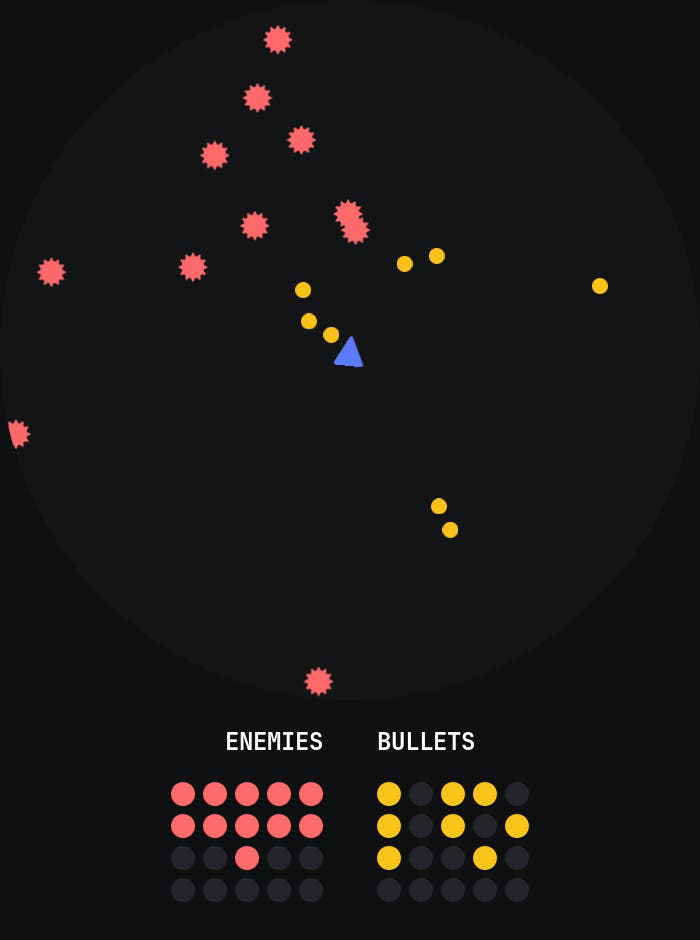

# Godot Object Pooling

Example for object pooling in Godot 4, use GDScript and C#.



## Switch To C#

By default it use GDScript, to switch to C# simply run:

```bash
git apply Patches/csharp.patch
```
